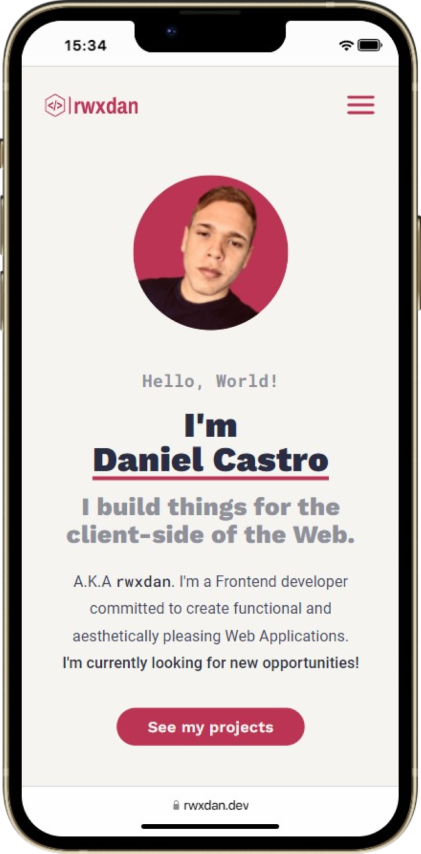
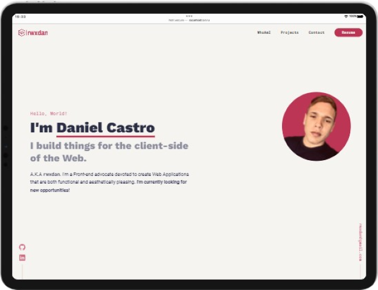
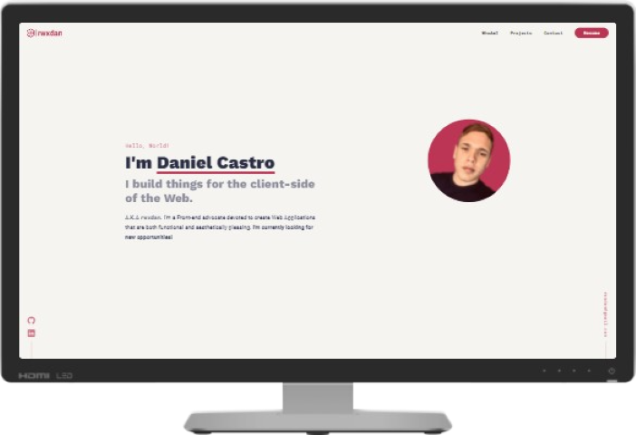

<div align="center">
  
</div>
<h1 align="center">
  rwxdan.dev
</h1>
<p align="center">
  The first version of <a href="https://rwxdan.dev/">rwxdan.dev</a>, my portfolio. Built with <a href="https://vitejs.dev/">Vite</a> and Deployed by <a href="https://vercel.com/">Vercel</a>
</p>
<div align="center">
    
</div>

|  |  |  |
| ---------------------------------------- | ----------------------------------------- | ------------------------------------------ |

## Tools used 🧰

- [NodeJS](https://nodejs.org/)
- [Vite](https://vitejs.dev/)
- [React](https://reactjs.org/)
- [TypeScript](https://typescriptlang.org/)
- [react-spring](https://react-spring.dev/)
- [@frank-mayer/react-tag-cloud](https://github.com/Frank-Mayer/react-tag-cloud)
- [PostCSS](https://postcss.org/)
- [Autoprefixer](https://autoprefixer.github.io/)
- [Figma](https://www.figma.com/)
- [Firefox](https://www.mozilla.org/en-US/firefox/)
- [Visual Studio Code](https://code.visualstudio.com/)

## Local development 🛠

1. Clone the project, then `cd` into it
```
git clone https://github.com/rwxdan/rwxdan.dev && cd rwxdan.dev
```
2. Install all the dependencies
```
yarn
```
3. Start the development server
```
yarn dev
```

## Do you want to contribute? 🤝

If you wish to help, you can either:

- [Report issues](https://github.com/rwxdan/rwxdan.dev/issues)
- Fork the project and submit a Pull Request (PR)
  - Please, try to use [sensible commit messages](https://cbea.ms/git-commit/)
  - Don't know how to submit a PR? Don't worry, see GH Docs: [Creating a pull request](https://docs.github.com/en/pull-requests/collaborating-with-pull-requests/proposing-changes-to-your-work-with-pull-requests/creating-a-pull-request)
- Give it a star! ⭐
