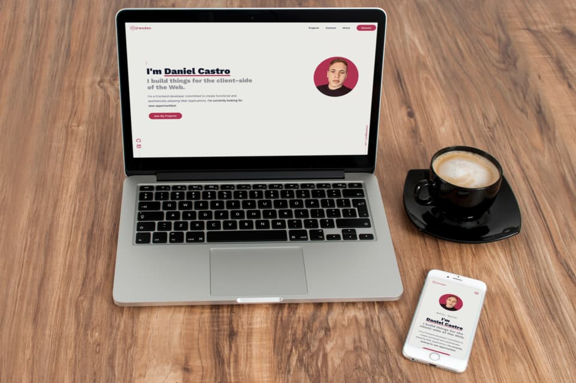

<div align="center">
  <a href="https://rwxdan.dev/"></a>
</div>
<h1 align="center">
  rwxdan.dev
</h1>
<p align="center">
  The first version of <a href="https://rwxdan.dev/">rwxdan.dev</a>, my portfolio. Built with <a href="https://vitejs.dev/">Vite</a> and Deployed by <a href="https://vercel.com/">Vercel</a>
</p>
<div align="center">
    
</div>



## Tools used 🧰

- [Vite](https://vitejs.dev/)
- [React](https://reactjs.org/)
- [TypeScript](https://typescriptlang.org/)

## Local development 🛠

1. Clone the project, then `cd` into it

```
git clone https://github.com/rwxdan/rwxdan.dev && cd rwxdan.dev
```

2. Install all the dependencies

```
yarn
```

3. Start the development server

```
yarn dev
```

## Do you want to contribute? 🤝

- If you see something wrong or you want to share an idea, please [open an issue](https://github.com/rwxdan/rwxdan.dev/issues)
- Fork the project and submit a [pull request](https://github.com/rwxdan/rwxdan.dev/pulls)
- Give it a star! ⭐

---

<div align="center">
  <h3>Thank You! ❤</h3>
</div>
